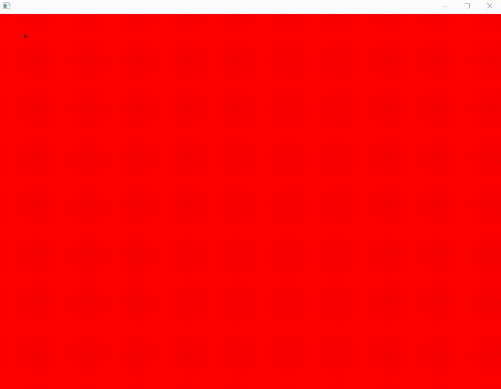

# ofxSceneManager

### Overview
referenced by https://github.com/kokinomura/ofxSceneManager.
Added function, transition mode "Slide", function "delay".
Added basic events. mouse move mouse scrolled, mouse exits, mouse entered.
Changed dependency addon ofxTween to ofxEasing.

### Dependency
ofxEaging

#### crousel
<!--  -->


#### simple fade in out
<!--  -->


### Getting Started

1. create class and Inherit ofxScene
```cpp
#include "ofxScene.h"

class Scene: public ofxScene {
public:

	//methods...

}

```

2. Instantiate ofxSceneManager and add scenes;

```cpp
class ofApp : public ofBaseApp {
public:

	void setup();
	void update();
	void draw();

    ofxSceneManager scenes;

}
```

```cpp
void ofApp::setup() {
    
    Scene a = make_shared<ofxScene>();
    Scene b = make_shared<ofxScene>();

    scenes.addScene(a);
    scenes.addScene(b);

}
```

3. setup ofxSceneManger and run

```cpp
void ofApp::setup() {
    Scene a = make_shared<ofxScene>();
    Scene b = make_shared<ofxScene>();

    scenes.addScene(a);
    scenes.addScene(b);

    //screen size, width, height
    scenes.setup(600, 600);
}

void ofApp::update() {
    scenes.update();
}

void ofApp::draw() {
    scenes.draw();
}
```

## Functionality
### Transition

```cpp
void ofApp::setup() {

    scenes.setExitByTime(false);
    scenes.setSceneDuration(0.3, 0.3);
    scenes.setTransitionMode(ofxSceneTransition::FADE);
    scenes.setup(ofGetWidth(), ofGetHeight());

}

void ofApp::keyPressed(int key){
  
    if (key == ' ') scenes.changeScene();
  
}
```